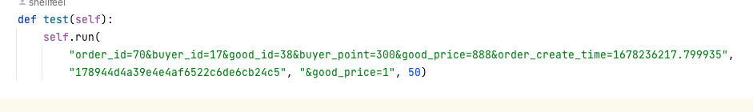

# hash-ext-attack
哈希长度扩展攻击利用脚本，免去了hashpump需要编译的烦恼

## 使用方法

### 交互式
1. 按照requirements.txt 安装好依赖
2. 运行 hash_ext_attack.py  脚本
3. 按照提示输入
4. 得到新的明文和新的hash

### 调用式
在不知道密钥长度需要爆破或者批量生成时有用

按照hash_ext_attack.test() 方法中的实例，在其他脚本中调用hash_ext_attack类中run方法
